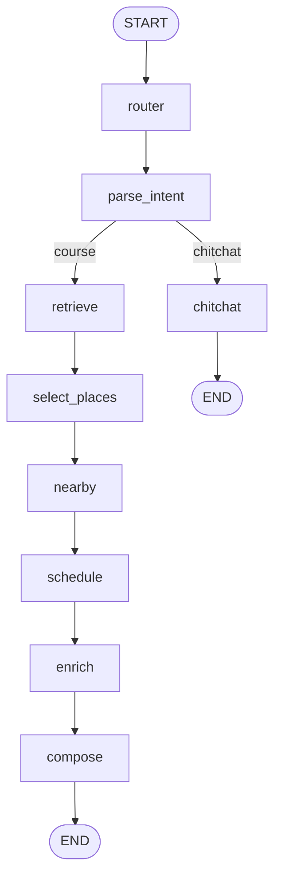

# lewisai — 서울로 AI (Python · LangGraph · RAG)

## 사이트 주소: https://seoulro.site/

서울로(strangemap)의 AI 기능을 **파이썬 LangGraph RAG 에이전트**로 재구현한 프로젝트.
서울로를 3-tier(프론트 Next.js / **AI 서버** / DB)로 분리하기 위한 AI 백엔드다.

**역할 분리 원칙**

| 담당 | 만드는 것 |
|---|---|
| **AI 서버** | 어떤 장소를 **왜** 골랐는지(`reason`/`activities`), 실시간 정보(예상 혼잡도·주변 식당·문화행사). 시간 범위가 있는 요청(칩 시간대·자연어 시간·여행자 기본값)은 **방문 순서·시각·이동수단까지 서버가 확정**(`schedule` 노드). |
| **strangemap 프론트(`courseRouting.ts`)** | 지도 폴리라인·실제 도로 경로 거리. 서버는 stop 좌표(`lat`/`lng`)만 실어 보낸다 — 시간표가 없는 코스는 방문 순서도 프론트가 정한다. |

## 사용자 입력 → 그래프 → 출력

에이전트는 **LangGraph StateGraph** 한 번 실행(`ainvoke`)으로 입력을 응답까지 만든다. 진입 방식은 두 가지다.

| 진입 방식 | 입력 | 동작 |
|---|---|---|
| 칩 진입 | 프론트 위저드가 고른 칩(동반·목적·위치·시간·인원 등) | 라우터를 건너뛰고 코스 파이프라인으로 직행(결정적) |
| 자연어 진입 | `message` 문자열 | 라우터가 코스/잡담을 분류 → 코스면 LLM이 문장에서 칩과 같은 구조(동반·목적·시간·일수)를 추출해 이후로는 칩 경로와 완전히 같은 코드를 탄다 |

예시로 자연어 하나가 실제로 어떻게 처리되는지:

> 입력: `"저녁에 연인이랑 홍대에서 야경 보면서 데이트할 코스 짜줘"`

| # | 노드 | 이 입력에서 실제로 하는 일 |
|---|---|---|
| 1 | `router` | LLM이 메시지를 `course`로 분류(장소/코스/동선 요청이므로). |
| 2 | `parse_intent` | LLM이 문장에서 `note`, `time="저녁"`(18~22시), `companion="연인과"`, `purpose="데이트"`를 뽑아 칩과 동일한 형태로 합성. 칩 진입이면 이 단계는 생략된다. |
| 3 | `retrieve` | 목적("데이트 분위기 야경 감성")·동반·위치·시간을 합친 쿼리로 Chroma에서 후보 40곳을 가져오고, "홍대·마포" 칩 좌표를 앵커 삼아 반경(5→7→10km)으로 좁힌 뒤 의미유사도·지리거리를 블렌드(3:7)해 재정렬한다. |
| 4 | `select_places` | LLM이 후보 중에서만(화이트리스트 강제, 환각 차단) 장소를 고르고 각 장소의 `reason`(왜 골랐는지)과 `activities`(거기서 할 일 2~3개)를 함께 만든다. |
| 5 | `nearby` | 확정 장소마다 주변 식당(권역 캐시 우선, 부족하면 실시간 보충)과 지금 진행 중인 문화행사(서울시 실시간 데이터)를 붙인다. |
| 6 | `schedule` | "저녁"이 시간 범위(18~22시)로 해석됐으므로 동작: 방문 순서 후보를 전수 탐색해 운영시간·이동거리가 최적인 순서를 고르고, 장소별 방문 시각·이동시간(도보/대중교통 추정)·식사 슬롯(권역 식당 3곳 옵션)까지 확정한다. 시간 범위가 없는 요청이면 이 노드는 아무 것도 하지 않고 건너뛴다. |
| 7 | `enrich` | schedule이 확정한 방문 시각 기준으로 그 시(時)의 **예상 혼잡도**(서울시 실시간 예보)를 붙인다. 혼잡도로 장소를 바꾸지는 않는다(표시 전용). |
| 8 | `compose` | LLM이 확정된 장소 위에 코스 제목·부제·전체 설명과 각 스톱의 소개 문구를 입힌다. 장소·개수·순서는 이미 고정, 여기서는 서사만 붙는다. |

최종 상태는 `{kind: "course", course: {title, stops: [...], ...}, steps: [...], source}` 형태로 정리돼 나간다. `stops[]`의 각 항목에는 이름·좌표·선정 이유·할 일·예상 혼잡도·주변 정보·(시간표가 있으면) 방문 시각까지 들어 있고, `steps[]`는 위 1~8 과정을 사람이 읽을 수 있게 요약한 트레이스라 챗봇 UI가 "이 코스가 어떻게 나왔는지"를 그대로 보여줄 수 있다. 코스 요청이 아니면 3번 이후 전부 건너뛰고 `chitchat` 노드가 짧은 답변을 만들어 `{kind: "text", text: "..."}`로 나간다.

## LangGraph 노드 연결 구조




| 노드 | 하는 일 |
|---|---|
| `router` | 자연어 메시지 → 의도(`course`/`chitchat`) 분류. 칩 진입은 건너뜀. |
| `parse_intent` | 자연어 → 칩과 같은 구조(note/time/companion/purpose/days)로 추출. 칩 진입은 그대로 통과. |
| `retrieve` | RAG 후보 검색 + 위치 앵커 반경 클러스터링·재랭킹. 여행자 멀티데이는 일차별로 다른 권역을 배정. |
| `select_places` | 후보 중에서만 장소를 선정 + 선정 이유·할 일 생성(화이트리스트로 환각 차단). |
| `nearby` | 확정 장소별 주변 식당 + 실시간 문화행사. |
| `schedule` | 시간 범위가 있을 때만: 방문 순서·시각·이동수단·식사 슬롯 확정. 없으면 통과. |
| `enrich` | 확정된(또는 현재) 방문 시각의 예상 혼잡도 부착. |
| `compose` | 확정 장소 위에 코스 제목·서사·스톱별 소개글 작성(장소·순서 불변). |
| `chitchat` | 코스 요청이 아닌 입력에 대한 짧은 대화 응답. |

## RAG 임베딩 데이터

임베딩 대상은 `data/embed/places.json` 하나로, 서로 다른 3개 원천을 정제·통합한 결과다(`scripts/build_embed_dataset.py`).

| 원천 | 수집 방법 | 반영 건수 |
|---|---|---|
| `seoul_places.json` | 수작업 정리 데이터(서울 대표 장소) | 170곳 |
| `culture_places.json` | Visit Seoul "문화관광" 카테고리 전량 수집(`build_culture_rag.py`, 한국어만 사용) | 327곳 |
| `poi_cache/쇼핑·자연관광·역사관광` | Visit Seoul 3개 카테고리를 권역별로 전량 수집(`build_poi_cache.py`) | 쇼핑 232 · 역사 78 · 자연 58곳 |

통합 과정에서 아래 기준으로 걸러내고 이름 기준 중복까지 제거해 **총 865곳**이 남는다.

| 정제 기준 | 내용 |
|---|---|
| 카테고리 컷 | 학교·행사장 등 코스 스톱으로 부적합한 분류 제외 |
| 서비스업 컷 | 미용실·병원·부동산 등 "코스로 갈 곳"이 아닌 개별 상호 제외 |
| 정보부족 컷 | 설명이 짧아 선정 이유·행동 추천의 근거로 못 쓰는 항목 제외 |
| 중복 제거 | 이름 정규화 기준, 우선순위 `seoul_places` > `poi_cache` > `culture_places` |

각 장소는 주소의 자치구를 기준으로 9개 권역 칩(종로·중구 / 강북·성북 / 홍대·마포 / 용산·이태원 / 여의도·영등포 / 강남·서초 / 성수·건대 / 잠실·송파 / 관악·사당) 중 하나로 매핑되고, 이름·카테고리·설명 키워드로 목적 태그(예: "힐링", "핫플레이스")가 다중 라벨로 자동 부여된다.

임베딩 본문(`ragText`)은 장소명·대분류·권역·설명·어울리는 목적·운영시간을 한 덩어리로 합친 문자열이며, 장소 1곳당 청크 1개로 임베딩된다. 임베딩 모델은 제미나이 네이티브(`gemini-embedding-001`), 벡터 저장소는 로컬 Chroma(`data/chroma`, persistent)다. 코스 검색(`retrieve` 노드)은 이 벡터스토어에서 의미 유사도로 40곳을 뽑은 뒤 좌표 기반으로 재랭킹한다.

## 실시간 데이터 (임베딩 아님)

혼잡도·문화행사·식당은 매번 실시간이라 임베딩하지 않고 호출 시점에 직접 가져와 프롬프트에 주입한다.

| 데이터 | 출처 | 캐시 전략 |
|---|---|---|
| 예상 혼잡도 | 서울시 열린데이터 `citydata_ppltn`(현재값+12시간 예보) | 5분 TTL |
| 진행 중 문화행사 | 서울시 열린데이터 `citydata`(EVENT_STTS) | 5분 TTL |
| 주변 식당 | Visit Seoul "음식" 카테고리를 미리 전량 수집해 9권역별로 구워둔 로컬 캐시(`data/meal_cache`, `build_meal_cache.py`) | 캐시 우선, 얇으면 라이브 조회로 보충 |

## 폴더 구조

```
app/
  main.py              FastAPI 엔트리 (+ GET / 정적 챗봇 UI)
  config.py            .env 설정(LLM 키/모델, 서울시·Visit Seoul API 키, 데이터 경로)
  core/                llm(업스테이지 솔라) · embeddings · vectorstore · json_parse · geo(좌표·9권역 칩) · scheduler(시간표 계산)
  rag/                 retriever(메타필터·재랭킹) · ingest(Chroma 배치 인제스트)
  tools/                congestion · events · visitseoul · meal_cache · poi_cache  (실시간/캐시, RAG 아님)
  graph/                LangGraph 에이전트 (state · build · nodes/{common,course,schedule,passthrough})
  features/            course · chitchat  (└ schema.py / chain.py)
  api/routes/          health · course · chitchat · chat
  static/              index.html (검증용 챗봇 UI)
data/raw/               seoul_places.json · culture_places.json (원천)
data/poi_cache/         쇼핑·자연관광·역사관광 권역별 POI 캐시 (임베딩 세트 빌드 재료)
data/meal_cache/        권역별 식당 캐시 (런타임 nearby 가 직접 읽음)
data/embed/             places.json (정제·통합 임베딩 세트 — 인제스트 소스)
data/chroma/            Chroma 영속(sqlite) — gitignore
scripts/                build_culture_rag.py · build_poi_cache.py · build_meal_cache.py · build_embed_dataset.py · run_ingest.py
tests/                   pytest 단위 테스트
```

## 빠른 시작

```bash
cd /Users/seodonghwi/Desktop/lewisai
uv sync                             # pyproject.toml + uv.lock 기준 .venv 동기화
cp .env.example .env                # ← UPSTAGE_API_KEY / GOOGLE_API_KEY / SEOUL_API_KEY / VISITSEOUL_API_KEY 입력

# (선택) 원천 데이터부터 새로 받으려면 — 이미 data/ 아래 있으면 생략 가능
uv run python scripts/build_culture_rag.py
uv run python scripts/build_poi_cache.py
uv run python scripts/build_meal_cache.py
uv run python scripts/build_embed_dataset.py   # 3개 원천 정제·통합 → data/embed/places.json

uv run python -m scripts.run_ingest            # 임베딩 → Chroma
uv run uvicorn app.main:app --reload --port 8800
```

> 의존성은 `pyproject.toml` 에 선언, 정확한 버전은 `uv.lock` 고정(둘 다 커밋).
> 추가/삭제는 `uv add <pkg>` / `uv remove <pkg>` (lock 자동 갱신).

## 엔드포인트

| 메서드 · 경로 | 기능 |
|---|---|
| `GET /` | 검증용 챗봇 UI(정적 페이지) |
| `GET /health` | 헬스체크 · 모델 정보 |
| `POST /agent/course` | 테마 코스 생성(칩 기반, 단일 기능) |
| `POST /agent/chitchat` | 일반 대화 |
| `POST /agent/chat` | **통합 진입점**(칩 또는 자연어 → 코스/잡담) |
| `POST /agent/chat/stream` | `/agent/chat` 의 SSE 스트리밍(진행 단계·토큰·최종 결과) |

## LLM / 임베딩

| 구분 | 모델 | 비고 |
|---|---|---|
| 챗 LLM | 업스테이지 솔라 `solar-open2` (`langchain-upstage`) | 추론(reasoning) 모델이지만 `LLM_REASONING_EFFORT=none`으로 꺼서 사고 과정 토큰이 응답을 잡아먹지 않게 함(레이턴시 약 8배 단축 실측) |
| 임베딩 | 제미나이 네이티브 `gemini-embedding-001` (`langchain-google-genai`) | 기존 Chroma 인덱스와 호환 유지를 위해 챗 모델 전환 후에도 그대로 사용 |

`.env` 에 `UPSTAGE_API_KEY`·`GOOGLE_API_KEY`, 실시간 정보용 `SEOUL_API_KEY`·`VISITSEOUL_API_KEY` 설정이 필요하다.
