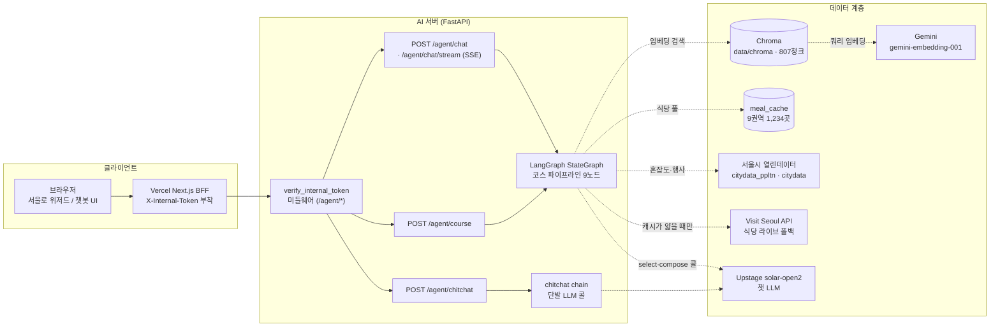
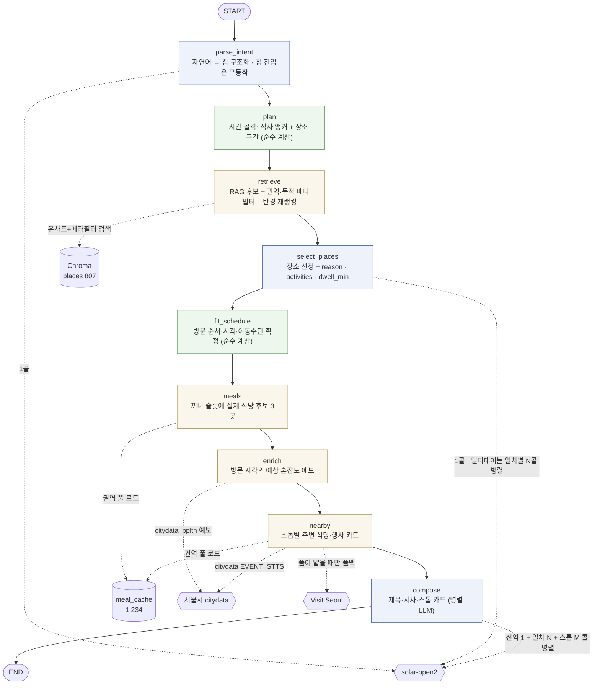

# lewisai — 서울로 AI (Python · LangGraph · RAG)

## 사이트 주소: https://seoulro.site/

서울로(strangemap)의 코스 생성 기능을 **파이썬 LangGraph RAG 에이전트**로 재구현한 프로젝트.
서울로를 3-tier(프론트 Next.js BFF / **AI 서버** / 데이터)로 분리하기 위한 AI 백엔드다.

**역할 분리 원칙**

| 담당 | 만드는 것 |
|---|---|
| **AI 서버 (이 저장소)** | 어떤 장소를 **왜** 골랐는지(`reason`/`activities`), 실시간 정보(예상 혼잡도·주변 식당·문화행사), 그리고 시간 창이 있는 요청의 **방문 순서·방문 시각·이동수단·식사 슬롯**(`plan` → `fit_schedule` → `meals`). |
| **strangemap 프론트(`courseRouting.ts`)** | 지도 폴리라인·실제 도로 경로 거리. 서버가 확정한 순서 위에 그린다 — 서버는 stop 좌표(`lat`/`lng`)를 시간표 순서로 실어 보낸다. |

에이전트의 임무는 **코스 생성 하나**다. 그래프에서 의도 분류(router)와 잡담(chitchat) 분기는 제거했다 —
클라이언트에 잡담 입력창이 없고 칩 경로에서는 라우터가 어차피 무동작이었다.
잡담은 그래프 밖 `/agent/chitchat` 라우트가 단발 LLM 콜로 따로 처리한다.

## 시스템 구조



## 사용자 입력 → 그래프 → 출력

에이전트는 **LangGraph StateGraph** 한 번 실행(`ainvoke`/`astream`)으로 입력을 응답까지 만든다.
진입 방식은 두 가지이고, `parse_intent` 이후로는 **완전히 같은 코드**를 탄다.

| 진입 방식 | 입력 | 동작 |
|---|---|---|
| 칩 진입 | 프론트 위저드가 고른 칩(동반·목적·위치·시간·끼니·인원·일수·밀도) | `req` 가 이미 주입돼 있으므로 `parse_intent` 는 무동작 — 결정적 |
| 자연어 진입 | `message` 문자열 | `parse_intent` 가 LLM 으로 문장에서 칩과 같은 구조(시간창·동반·목적·끼니·일수·밀도)를 추출해 합성 |

예시로 자연어 하나가 실제로 어떻게 처리되는지:

> 입력: `"저녁에 연인이랑 홍대에서 야경 보면서 데이트할 코스 짜줘"`

| # | 노드 | 이 입력에서 실제로 하는 일 |
|---|---|---|
| 1 | `parse_intent` | LLM 이 `note`, `time="저녁"` → `time_window 18~22`, `companions=["연인과"]`, `purposes=["데이트"]` 를 뽑아 칩과 동일한 형태로 합성한다. "저녁에"는 시간대 표현일 뿐 식사 의도가 아니라 `meals=[]`. 칩 진입이면 이 단계는 통째로 생략된다. |
| 2 | `plan` | 순수 계산(0ms). 창 18~22시 · 끼니 없음 → 세그먼트 1개(240분), 하루 4곳 배정. 이 골격을 `select` 프롬프트에 실어 보낸다. |
| 3 | `retrieve` | 목적 확장어("데이트 분위기 야경 감성")·동반·시간을 합친 쿼리로 Chroma 검색. 자연어에는 위치 칩이 없으므로 앵커는 **의미 유사도 1위 후보의 좌표**("홍대"가 쿼리에 있어 상위가 홍대권으로 잡힌다). 반경 5→7→10km 로 좁힌 뒤 유사도:근접도 3:7 블렌드로 재정렬하고, 같은 좌표 묶음(`same_place_group`)은 1곳만 남겨 10곳을 넘긴다. |
| 4 | `select_places` | LLM 이 후보 중에서만(화이트리스트 강제 — 환각 차단) 4곳을 골라 `reason`(왜 골랐는지)·`activities`(할 일 2~3개)·`dwell_min`(그 활동에 걸리는 체류시간)을 함께 만든다. |
| 5 | `fit_schedule` | 4곳의 방문 순서를 순열 전수 탐색(이동거리 최소)으로 확정하고, 세그먼트 240분 예산에서 이동시간을 뺀 나머지를 `dwell_min` 비율대로 나눠 방문 시각·이동수단(도보/대중교통)을 붙인다. 예산에 못 앉은 장소는 `flex`(시각 없는 자유 방문 제안). |
| 6 | `meals` | 이 요청은 끼니를 안 골랐으므로 즉시 반환(무동작). 끼니가 있으면 직전 장소를 앵커로 권역 캐시에서 식당 후보 3곳을 랜덤 선택해 슬롯을 채운다. |
| 7 | `enrich` | `fit_schedule` 이 확정한 방문 시각 기준으로 그 시(時)의 **예상 혼잡도**(서울시 예보)를 붙인다. 혼잡도로 장소를 바꾸지는 않는다(표시 전용). |
| 8 | `nearby` | 확정 장소마다 주변 식당(권역 캐시, 얇으면 Visit Seoul 라이브 보충)과 진행 중인 문화행사(citydata 실시간)를 카드로 붙인다. |
| 9 | `compose` | LLM 이 확정된 시간표 위에 코스 제목·부제·전체 설명과 스톱별 카드 문구를 입힌다. 장소·개수·순서는 이미 고정 — 여기서는 서사만 붙는다. 콜은 **전역 1개 + (멀티데이면) 일차 N개 + 스톱 청크 M개**를 동시에 던진다. |

최종 응답은 `{kind: "course", course: {...}, source, steps: [...]}` 형태다.
`course.stops[]` 각 항목에는 이름·좌표·선정 이유·할 일·체류시간·예상 혼잡도·주변 정보·(시간표가 있으면)
방문 시각·이동시간·식사 옵션까지 들어 있고, `steps[]` 는 위 2~9 과정을 사람이 읽을 수 있게 요약한
트레이스라 챗봇 UI 가 "이 코스가 어떻게 나왔는지"를 그대로 보여줄 수 있다.

## LangGraph 노드 연결 구조

그래프는 **분기 없는 선형 파이프라인**이다. 시간 창이 없거나 끼니를 안 고른 요청도 그래프를
분기하지 않고, 해당 노드가 빈 산출물을 내며 통과한다(하위 노드는 "세그먼트/슬롯 리스트" 하나로
동일하게 동작). 조건부 엣지를 없앤 만큼 실패 지점과 트레이스가 단순해진다.



### 노드별 역할과 상태(AgentState) 쓰기

| 노드 | 하는 일 | 읽는 상태 | 쓰는 상태 |
|---|---|---|---|
| `parse_intent` | 자연어 → 칩과 같은 구조로 추출·검증(허용값만 통과). 칩 진입(`req` 주입)이면 그대로 통과. | `message`, `req` | `req` |
| `plan` | 칩만으로 하루 골격 — 식사 고정 시각(아침 10·점심 13·저녁 19시)이 창을 잘라 세그먼트를 만들고, 세그먼트 길이·수용한계에 맞춰 장소 수를 배정. LLM·네트워크 없음. | `req` | `skeleton` |
| `retrieve` | 목적 확장어로 벡터 검색 + `권역+목적 → 권역 → 목적 → 무필터` 순 완화, 아는 운영시간이 창과 안 맞는 곳은 하드 제외, 앵커 반경(5→7→10km) 안에서 유사도:근접도 3:7 재정렬, 동일 좌표 묶음 중복 제거. 여행자 멀티데이 + 위치 상관없음이면 일차별로 다른 권역을 배정해 따로 검색. | `req` | `candidates`, `day_areas` |
| `select_places` | 후보 안에서만 장소 선정(화이트리스트 강제) + 선정 이유·할 일·희망 체류시간 생성. 골격을 프롬프트에 실어 구간 배정 수를 지키게 한다. 2곳 미만이면 후보 상위로 폴백(`source="mock"`). | `req`, `candidates`, `skeleton` | `selected`, `source` |
| `fit_schedule` | 구간 예산에 장소를 앉힌다 — 순열 전수 탐색(≤6곳)으로 이동거리 최소 순서, 이동시간 차감 후 희망 체류시간 비율대로 예산 분배(하한 30분·상한 180분), 식사 슬롯 자리 확보. **`selected` 를 시간표 순서로 재정렬해 내보낸다.** 창이 없으면 빈 시간표. | `req`, `selected`, `skeleton`, `day_areas` | `selected`(재정렬), `schedule` |
| `meals` | 식사 슬롯마다 직전(없으면 직후) 장소를 앵커로 1.5km → 못 채우면 3km 안에서 끼니 구성대로(점심 식당2+카페1 / 저녁 식당2+주점1) 랜덤 3곳. 영업시간 파싱으로 그 시각 문 여는 곳만. 코스 내 중복 없음. | `schedule`, `selected` | `schedule`(슬롯 채움), `meal_pool` |
| `enrich` | 각 장소의 방문 시각 예보 혼잡도(`citydata_ppltn` 12시간 예보)를 병렬 조회해 붙인다. 측정 지점(`area_name`)이 등록된 장소만 값이 생긴다. | `selected`, `schedule` | `congestion` |
| `nearby` | 스톱별 주변 카드 — 식당은 권역 캐시(부족하면 Visit Seoul 라이브 보충), 행사는 스톱이 속한 명소의 citydata 실시간 행사. | `selected`, `meal_pool` | `nearby`, `meal_pool` |
| `compose` | 확정 장소 위에 제목·부제·전체 설명·(멀티데이) 일차 요약·스톱 카드 문구. 장소·개수·순서 불변. 콜을 쪼개 병렬로 던지고 부분 실패는 그 콜의 몫만 잃는다. 최종 `stops[]` 페이로드까지 조립. | `req`, `selected`, `schedule`, `congestion`, `nearby` | `result`, `source` |

### 왜 이 순서인가

| 배치 | 이유 |
|---|---|
| `plan` 이 `retrieve` 앞 | 식사 시각이 칩으로 확정돼 있어 장소를 고르기 **전에** 하루가 어떻게 나뉘는지 알 수 있다. 골격을 select 프롬프트에 실으면 LLM 이 구간을 알고 장소 수·체류시간을 낸다. |
| `fit_schedule` 이 `select` 뒤 | 시간표는 확정된 장소의 좌표·희망 체류시간이 있어야 계산된다. 시간 산술은 LLM 에게 맡기지 않고 코드가 확정한다. |
| `meals` 가 `fit_schedule` 뒤 | 식사 앵커는 "그 끼니 직전 장소"이므로 시간표가 정해진 뒤라야 잡힌다. |
| `enrich` 가 시간표 뒤 | 방문 시각을 알아야 그 시(時)의 혼잡도 **예보**를 조회할 수 있다(현재값이 아니다). |
| `nearby` 가 `compose` 앞 | 최종 payload 카드용이라 마지막이면 되고, 혼잡도와 함께 서사 프롬프트에 실린다. |

### 레이턴시 설계 (LLM 콜 분할)

실측(solar-open2)에서 `compose` 가 코스 생성 총 시간의 66~69%를 먹었고, 그 시간은 프롬프트
크기가 아니라 **출력 토큰 수에 비례**했다. 그래서 한 콜이 전역 서사 + 스톱 N개를 다 쓰던 구조를
쪼개 동시에 던진다.

| 콜 | 개수 | 비고 |
|---|---|---|
| `parse_intent` | 1 (자연어 진입만) | 칩 진입은 0콜 |
| `select_places` | 1 · 일차별 권역 분산이면 일차마다 1콜 병렬 | 후보가 `day_hint` 로 서로소라 중복이 날 수 없다. 4,000토큰 절단으로 select 가 통째로 날아가던 문제도 함께 해소 |
| `compose` | 전역 1 + 일차 N(멀티데이) + 스톱 청크 M(스톱 3곳 단위, 일차 경계를 넘지 않고 크기 균등) | 벽시계는 가장 긴 콜로 수렴하므로 콜당 출력을 고르게 나누는 것이 핵심 |

- `LLM_REASONING_EFFORT=none` — solar-open2 는 추론 모델이라 사고 과정이 `max_tokens` 예산을
  먼저 먹어 실제 답이 잘렸다(→ JSON 파싱 실패 → mock 폴백). 끄면 정상 생성 + 실측 29s→3.7s.
- JSON 이 잘려도 완결된 객체는 건져 쓴다(`salvage_objects`) — 청크 하나가 통째로 빈 카드가 되지 않게.
- 측정: `uv run python -m scripts.profile_course` (노드별 벽시계 · 시나리오 3종).

## RAG 임베딩 데이터

임베딩 대상은 `data/embed/places.json` 하나이며, **총 807곳**(장소 1곳 = 청크 1개)이다.
원천 3종(수작업 `seoul_places` + Visit Seoul 문화/쇼핑/역사/자연 카테고리 전량 수집)을 정제·통합한
결과물인데, **빌드 파이프라인은 폐기했다(2026-07-28)** — 이제 이 파일 자체가 소스오브트루스이고
장소 수정은 파일을 직접 고쳐 재인제스트한다.

| 원천(`source`) | 건수 |
|---|---|
| `visitseoul_culture` | 293 |
| `visitseoul_shopping` | 224 |
| `seoul_places` (수작업 정리) | 159 |
| `visitseoul_history` | 77 |
| `visitseoul_nature` | 51 |
| `manual` | 3 |

정제 기준은 카테고리 컷(학교·행사장 등), 서비스업 컷(미용실·병원·부동산 등 개별 상호),
정보부족 컷(설명이 짧아 선정 근거로 못 쓰는 항목), 이름 정규화 기준 중복 제거였다.

| 축 | 값 |
|---|---|
| 권역(`area`, 9칩) | 종로·중구 310 · 강남·서초 100 · 홍대·마포 92 · 성수·건대 72 · 용산·이태원 61 · 여의도·영등포 55 · 강북·성북 50 · 잠실·송파 43 · 관악·사당 24 |
| 대분류(`coarse_category`) | 쇼핑 273 · 문화 195 · 자연 161 · 역사 96 · 명소 57 · 체험 25 |
| 목적 태그(다중 라벨, `purpose_tags`) | 데이트 587 · 문화·예술 362 · 관광 명소 338 · 쇼핑 298 · 자연·힐링 230 · 체험·놀거리 211 · 핫플레이스 113 |
| 운영시간 확인(`hours_known`) | 확인 581 · 미확인 226 |
| K-콘텐츠 촬영지(`isFilming`) | 30 |

- **권역(`area`)은 주소의 자치구 기준**으로 확정한다(25개 자치구 → 9칩 매핑, `core/geo.py`).
  좌표 최근접(`nearest_chip`)은 한강·칩 경계에서 강 건너로 튀므로 주소가 있으면 항상 자치구 표가 이긴다.
- 목적 태그는 검색 단계 필터로 쓰기 위해 `pt_<slug>` 불리언 메타로 펼쳐 색인한다
  (Chroma `where` 는 콤마 문자열 부분일치를 못 한다).
- `hours_known=False` 는 `(0,24)` 로 채워져 있을 뿐 "상시개방"이 아니다 — 시간창 필터는
  **아는 시간이 안 맞는 곳만** 하드 제외한다.
- `same_place_group` 은 좌표가 같은 장소 묶음(예: 광화문광장 ⟷ 해치마당) — 한 코스에 하나만 넣는 근거.
- 임베딩 본문(`ragText`)은 장소명·대분류·권역·설명·어울리는 목적·운영시간을 합친 문자열.
  임베딩 모델은 제미나이 네이티브(`gemini-embedding-001`), 저장소는 로컬 Chroma(`data/chroma`, persistent).

## 실시간·캐시 데이터 (임베딩 아님)

혼잡도·문화행사·식당은 매번 달라지므로 임베딩하지 않고 호출 시점에 가져와 프롬프트/페이로드에 주입한다.

| 데이터 | 출처 | 전략 |
|---|---|---|
| 예상 혼잡도 | 서울시 열린데이터 `citydata_ppltn` (현재값 + 12시간 시(時)단위 예보) | 5분 TTL 캐시. 코스는 미래 방문이므로 **예보**를 쓴다 |
| 진행 중 문화행사 | 서울시 열린데이터 `citydata` (EVENT_STTS) | 5분 TTL 캐시. 명소당 1회 조회 |
| 식당 | Visit Seoul "음식" 카테고리 전량을 9권역으로 구워둔 로컬 캐시 `data/meal_cache` (**1,234곳**: 종로·중구 389 · 강남·서초 188 · 홍대·마포 182 · 용산·이태원 135 · 성수·건대 113 · 여의도·영등포 77 · 강북·성북 76 · 잠실·송파 52 · 관악·사당 22) | 파일 읽기(프로세스당 1회, `lru_cache`) → 네트워크 왕복 0. 풀이 `MEAL_POOL_MIN` 보다 얇을 때만 Visit Seoul 라이브 폴백 |

식사 후보는 **반경 안에서 랜덤**으로 뽑는다. 거리순 상위 3곳은 같은 앵커면 항상 같은 답이 나오고,
권역 전체 랜덤은 권역이 너무 넓어(중심~최원거리 실측 8.7~11.0km) 홍대 점심에 은평 식당이 섞인다.
1.5km 를 먼저 보고 3곳을 못 채울 때만 3km 로 넓힌다(아침은 재고가 얇아 자주 여기까지 간다).

## 폴더 구조

```
app/
  main.py              FastAPI 엔트리 · X-Internal-Token 미들웨어 · GET / 정적 챗봇 UI
  config.py            .env 단일 출처 (LLM 키/모델, 서울시·Visit Seoul 키, 데이터 경로)
  core/
    llm.py             업스테이지 솔라 (FallbackLLM 은 비활성 보존) · extract_text
    embeddings.py      제미나이 네이티브 임베딩 팩토리
    vectorstore.py     Chroma persistent 싱글턴
    json_parse.py      LLM JSON 파싱 + 잘린 응답 부분 복구(salvage)
    geo.py             haversine · 위치 칩 9종 · 자치구→권역 매핑
    plan.py            시간 골격(세그먼트·식사 앵커) + 구간별 장소 배정
    scheduler.py       방문 순서(순열 탐색) · 예산 배분 · 이동시간 추정
  rag/
    retriever.py       Chroma 메타필터 검색(+score)
    ingest.py          places.json → 배치 인제스트 (쿼터 대비 배치·대기)
  tools/               congestion · events · visitseoul · meal_cache  (실시간/캐시, RAG 아님)
  graph/
    state.py           AgentState (TypedDict)
    build.py           StateGraph 조립·컴파일 · run/stream 진입점 · steps 트레이스 · payload
    nodes/             common(parse_intent) · planning(plan) · course(retrieve/select/enrich/nearby/compose)
                       · schedule(fit_schedule) · meals(meals)
  features/
    course/            schema.py (칩·응답 계약) · chain.py (/agent/course 어댑터)
    chitchat/          chain.py (그래프 밖 단발 LLM 콜)
  api/routes/          health · course · chitchat · chat(+SSE)
  static/              index.html (검증용 챗봇 UI)
data/embed/places.json   임베딩 세트 807곳 — 인제스트 소스이자 소스오브트루스
data/meal_cache/         권역별 식당 캐시 9파일 1,234곳 (런타임이 직접 읽음)
data/mock/               visitseoul_sample.json (키 없을 때 Mock 클라이언트용)
data/chroma/             Chroma 영속(sqlite) — gitignore
scripts/                 run_ingest.py · build_meal_cache.py · profile_course.py · check_upstage.py
tests/                   pytest 단위 테스트 8종 (스케줄러·식사캐시·주변정보·행사·계약 회귀 등)
docs/                    배포 아키텍처 · 코스 재설계 · 임베딩 품질 A/B · 로드맵
ab_artifacts/            임베딩/코스 A/B 실험 산출물
```

## 빠른 시작

```bash
cd /Users/seodonghwi/Desktop/lewisai
uv sync                             # pyproject.toml + uv.lock 기준 .venv 동기화
cp .env.example .env                # ← UPSTAGE_API_KEY / GOOGLE_API_KEY / SEOUL_API_KEY / VISITSEOUL_API_KEY 입력

# (선택) 식당 권역 캐시 재빌드 — 이미 data/meal_cache 에 있으면 생략. Visit Seoul 전량 훑기라 15분 안팎
PYTHONPATH=. uv run python scripts/build_meal_cache.py

uv run python -m scripts.run_ingest            # data/embed/places.json → 임베딩 → Chroma
uv run uvicorn app.main:app --reload --port 8800
```

```bash
uv run pytest                                   # 단위 테스트
PYTHONPATH=. uv run python scripts/check_upstage.py     # 솔라 연결·모델 alias 확인
uv run python -m scripts.profile_course                  # 노드별 레이턴시 계측
```

> 의존성은 `pyproject.toml` 에 선언, 정확한 버전은 `uv.lock` 고정(둘 다 커밋).
> 추가/삭제는 `uv add <pkg>` / `uv remove <pkg>` (lock 자동 갱신).

## 엔드포인트

`AI_SERVER_TOKEN` 이 설정돼 있으면 `/agent/*` 는 `X-Internal-Token` 헤더가 일치할 때만 통과한다
(BFF 만 호출하도록 하는 공유 시크릿). 비어 있으면 로컬 개발용으로 검증을 건너뛴다.
`/health` 프로브와 정적 UI 는 토큰 없이 열린다.

| 메서드 · 경로 | 기능 |
|---|---|
| `GET /` | 검증용 챗봇 UI(정적 페이지) |
| `GET /health` | 헬스체크 · LLM/임베딩 모델 정보 |
| `POST /agent/chat` | **통합 진입점** — `chips` 있으면 칩 진입, 없으면 `message` 자연어 진입. 응답에 `steps[]` 트레이스 포함 |
| `POST /agent/chat/stream` | 위와 동일 입력의 SSE 스트리밍. 이벤트: `progress`(노드 완료) → `final`(payload). 코스 출력은 JSON 이라 토큰은 흘리지 않는다 |
| `POST /agent/course` | 코스 생성 단일 기능(`CourseResponse` 스키마 — `steps` 없음) |
| `POST /agent/chitchat` | 그래프 밖 단발 대화 응답 |

## LLM / 임베딩

| 구분 | 모델 | 비고 |
|---|---|---|
| 챗 LLM | 업스테이지 솔라 `solar-open2` (`langchain-upstage`) | Solar Agent Partner Private Beta (400 RPM / 150K TPM). 추론 모델이지만 `LLM_REASONING_EFFORT=none` 으로 꺼서 사고 과정 토큰이 응답을 잡아먹지 않게 한다(실측 29s→3.7s). `LLM_MAX_TOKENS=4000` |
| 임베딩 | 제미나이 네이티브 `gemini-embedding-001` (`langchain-google-genai`) | 기존 Chroma 인덱스와 호환 유지를 위해 챗 모델 전환 후에도 그대로 사용 |
| 폴백 | `FallbackLLM`(제미나이→클로드)·`_gemini()` 는 코드에 보존, 현재 미사용 | 프로바이더 복구가 필요해질 때 그대로 재사용 가능 |

`.env` 에 `UPSTAGE_API_KEY`·`GOOGLE_API_KEY`, 실시간 정보용 `SEOUL_API_KEY`·`VISITSEOUL_API_KEY`,
프로덕션 연동용 `AI_SERVER_TOKEN` 설정이 필요하다.
