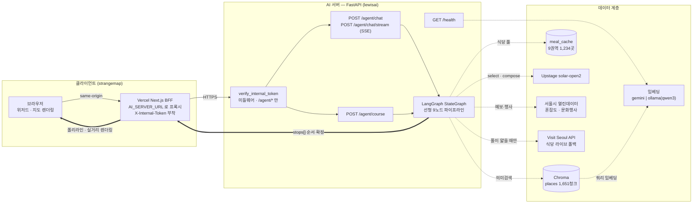
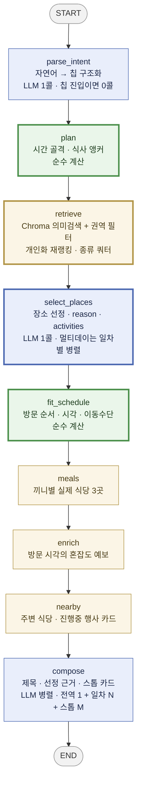
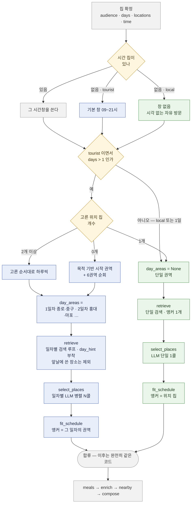

# 서울로 AI (lewisai)

> 선택 몇 번으로 **시간표까지 완성된 코스**를 만들어 주는 LangGraph RAG 에이전트 서버.
> 실제 서울속 장소 1,651곳을 임베딩해 두고, 검색 → 선정 → 시간표 → 실시간 정보 → 서사를 9개 노드로 나눠 처리한다.

**서비스주소**: https://seoulro.site/ · **프론트 레포**: [seoulbidata/strangemap](https://github.com/seoulbidata/strangemap)

---

## 데모GIF


서울로 나만의코스 기능 (3배속)

  

---

## 프로젝트 개요

기존 서울로 프로젝트는 Next.js기반의 풀스택 프레임워크를 사용하기 때문에 랭그래프와 RAG 생태계의 에이전트를 만들기 위해선 Python 언어를 기반으로 만들어야 했다. 

lewisai는 나만의 코스 기능을 에이전트로 고도화 하기 위한 프로젝트이며 실제 서울속 장소의 다양성과 더 정교한 사용자 맞춤 선택구조 + 자연어 입력 기반으로 코스가 생성되도록 하였다.

---

## 주요 기능

- **사용자 선택에 따라 완성되는 코스** — 동반·목적·위치·시간·식사수·인원·일수·혼잡도 여부를 고르면 장소 선정부터 방문 시각까지 서버가 확정한다. 자연어 한 줄(`"저녁에 연인이랑 홍대에서 야경"`)로도 같은 결과를 낸다.
- **"왜 이 장소인가"를 함께 추천한다.** — 각 스톱에 선정 이유(`reason`)와 그곳에서 할 일(`activities`)이 붙는다. 실제 시설·볼거리(`highlights`)에 근거를 걸어 "산책하기 좋아요" 같은 일반론을 막았다.
- **실행 가능한 시간표** — 방문 순서를 순열 전수 탐색으로 최적화하고, 남은 시간 예산을 체류시간 비율대로 나눠 방문 시각·이동수단까지 확정한다. 시간 산술은 LLM 에게 맡기지 않는다.
- **예상 혼잡도 반영** — 방문 시각 기준 서울시 **예상 혼잡도**(현재값이 아니라 예보), 진행 중인 문화행사, 주변 식당 정보를 붙인다.
- **같은 조건이면 같은 코스, "다시 만들기"는 다른 코스** — 시드를 칩+자유입력 해시로 잡아 재현 가능하게 두고, `seed` 를 실어 보내면 달라진다. A/B 와 디버깅이 가능해진다.
- **생성 과정이 보이는 스트리밍** — SSE 로 노드별 진행 상황(`progress`)을 흘려 "지금 뭘 하고 있는지"를 UI 가 그대로 보여준다.

---

## 기술 스택 & 아키텍처

### 선택 이유

| 기술 | 왜 선택했나 |
|---|---|
| **LangGraph** (StateGraph) | 단계별 중간 산출물을 `AgentState` 한 곳에 쌓아야 했다. 체인으로 엮으면 "이 코스가 왜 이렇게 나왔는지" 트레이스를 못 만든다. 노드 단위라 `steps[]` 트레이스와 SSE 진행률이 공짜로 나온다 |
| **Chroma** (로컬 persistent) | 장소 1,651개는 벡터 DB 를 따로 띄울 규모가 아니다. sqlite 파일이라 배포 이미지에 구워 읽기 전용으로 올릴 수 있다 |
| **FastAPI + SSE** | 코스 생성이 20~30초 걸려 진행 상황 표시가 필수였다. 양방향 통신이 필요 없어 WebSocket 대신 **SSE** — BFF 가 그대로 파이프만 하면 되고 재연결도 브라우저가 알아서 한다 |
| **Upstage `solar-open2`** | 한국어 장소명·지명 처리와 JSON 구조화 출력이 안정적이었다. 추론 모드는 껐다(아래 트러블슈팅 참고) |
| **임베딩 프로바이더 분리** (`gemini` \| `ollama`) | 제미나이 무료 쿼터로는 1,651청크 재인제스트에 24분+ 이 걸려 데이터 수정 루프를 못 돈다. 로컬 `qwen3-embedding:8b` 로 9분으로 줄였다. 챗 LLM 과 완전히 독립이라 챗은 솔라-open2 API를 사용, 임베딩은 현재는 로컬 테스트 단계라 `qwen3-embedding:8b` 모델을 사용중이만 실제 서빙시에는 메모리에 제약이 있어 바꿀 예정이다. |
| **순수 계산 노드 분리** (`plan`/`fit_schedule`) | 시간 산술과 동선 최적화는 결정적이어야 한다. LLM 에 맡기면 검증이 불가능 하기 때문에 로직으로 처리한다. |
| **uv** | `pyproject.toml` + `uv.lock` 커밋으로 팀·배포 환경 버전을 고정 |

## 클라이언트와 AI 서버의 연결 아키텍쳐



**역할 경계**: "어디를·왜·어떤 순서로" 는 AI 서버가 끝낸다. 프론트는 그 순서 위에 지도 SDK 로 **실제 도로 폴리라인을** 그린다.

### LangGraph 파이프라인

그래프 엣지는 고정된 워크플로우 기반의 선형노드이다. 관광객/현지인, 시간대 선택 유무, 식사 유무 같은 갈래는 엣지가 아니라 노드 안에서 처리한다 

워크플로우 방식을 사용하는 이유는 코스 생성은 무엇을 할지가 요청 시점에 이미 정해지는 작업이라, 모델이 다음 단계를 선택할 필요가 없다. 툴콜링 루프를 씌우면 레이턴시만 늘어나기 때문이다.



초록 = 순수 계산(LLM 없음) · 파랑 = LLM 호출 · 노랑 = 외부 데이터 · **테두리가 굵은 4개 = 노드 안에서 갈래가 생기는 지점**.
외부 의존은 `retrieve` → Chroma, `meals`·`nearby` → meal_cache, `enrich`·`nearby` → 서울시 citydata, LLM 3노드 → solar-open2 다.

9개 노드 중 LLM이 판단해야 할 TASK는 3개이고, 나머지는 로직으로 계산한다.

### 관광객 · 현지인 분기

페르소나 축은 `audience`(`local` | `tourist`) 하나뿐이고, 코드에서 실제로 갈라지는 곳은 **정확히 세 군데**다. 나머지는 전부 같은 함수를 탄다.

| 갈라지는 곳 | `tourist` | `local` |
|---|---|---|
| `_base_window()` — 시간 칩이 없을 때 | 기본 창 **09~21시**를 준다 (여행자는 하루를 통으로 쓴다고 본다) | 창을 만들지 않는다 → **시각 없는 자유 방문 코스** |
| `_day_areas()` — 여러 날 요청일 때 | 일차별로 **권역을 나눠 배정** | 항상 단일 권역 (생활권 안에서 논다) |
| `summary()` 프롬프트 라벨 | `"서울 여행자"` | `"시민"` |

이 중 `_day_areas()` 의 결과가 있느냐 없느냐가 하위 세 노드의 동작까지 바꾼다:



**합쳐 둔 것** — 갈래를 늘리지 않으려고 의도적으로 공유한 지점들이다.

- `locations` 를 **하나만** 고른 여행자는 현지인과 똑같이 단일 권역으로 떨어진다. "그 동네에서만 놀고 싶다"는 뜻이라 굳이 나눌 이유가 없다.
- `retrieve` 의 갈래는 **루프를 도느냐 마느냐**뿐이다. 안쪽에서 쓰는 `_search_pool` → `_geo_rerank` → `_dedupe_same_place` → `_quota_pick` 는 완전히 같은 함수다. 일차별 호출은 시드에 일차 번호만 더한다(`seed + d`).
- `select_places` 의 병렬 N콜도 **프롬프트가 다른 게 아니라 후보 목록만 일차별로 잘라 넣은** 같은 콜이다. 후보에 `day_hint` 가 박혀 있어 서로소라 중복이 날 수 없다.
- `fit_schedule` 은 앵커 좌표만 다르고 순열 탐색·예산 배분 로직은 하나다 (`day_areas` 가 없으면 위치 칩으로 폴백).
- **`meals` 부터 `compose` 까지 4개 노드는 분기가 아예 없다.** 여행자든 현지인이든 그 시점엔 "확정된 스톱 목록 + 시간표"라는 같은 모양이 되어 있기 때문이다.

### 엔드포인트

| 메서드 · 경로 | 기능 |
|---|---|
| `GET /` | 검증용 챗봇 UI (정적 페이지) |
| `GET /health` | 헬스체크 · LLM/임베딩 프로바이더 · Chroma 컬렉션 |
| `POST /agent/chat` | 통합 진입점 — `chips` 있으면 칩 진입, 없으면 `message` 자연어 진입 |
| `POST /agent/chat/stream` | 위와 동일 입력의 SSE. `progress`(노드 완료) → `final`(payload). **프론트가 실제로 쓰는 경로** |
| `POST /agent/course` | 코스 생성 단일 기능 (`CourseResponse`) |

---

## 폴더 구조

```
app/
  main.py              FastAPI 엔트리 · X-Internal-Token 미들웨어 · 정적 UI
  config.py            .env 단일 출처 (프로바이더·API 키·데이터 경로)
  api/routes/          health · course · chat(+SSE)
  core/                LLM·임베딩·벡터스토어 팩토리 + 순수 계산 로직
    llm.py             프로바이더 스위치 (upstage | gemini | claude)
    embeddings.py      gemini | ollama(Qwen3 쿼리 프리픽스 래퍼)
    vectorstore.py     Chroma persistent 싱글턴
    json_parse.py      LLM JSON 파싱 + 잘린 응답 부분 복구(salvage)
    geo.py             haversine · 위치 칩 9종 · 자치구→권역 매핑
    plan.py            시간 골격 (세그먼트·식사 앵커) — 순수 계산
    scheduler.py       방문 순서 순열 탐색 · 예산 배분 — 순수 계산
  graph/
    state.py           AgentState (TypedDict)
    build.py           StateGraph 조립 · run/stream 진입점 · steps 트레이스
    nodes/             common(parse_intent) · planning(plan) · schedule · meals
                       · course(retrieve/select/enrich/nearby/compose)
  rag/
    retriever.py       Chroma 메타필터 검색(+score)
    ingest.py          places.json → 임베딩 본문 조립 → 배치 인제스트
  tools/               congestion · events · visitseoul · meal_cache (실시간/캐시, RAG 아님)
  features/course/     schema.py (칩·가중치·응답 계약) · chain.py (어댑터)
  static/              index.html (검증용 챗봇 UI)

data/
  embed/places.json    임베딩 세트 1,651곳 — 인제스트 소스이자 소스오브트루스
  meal_cache/          권역별 식당 캐시 9파일 1,234곳 (런타임이 직접 읽음)
  chroma/              Chroma 영속 sqlite (gitignore)
  mock/                키 없을 때 쓰는 Mock 응답

scripts/               인제스트·캐시 빌드 (run_ingest · build_meal_cache · start_ollama.sh)
                       스키마 검증 (normalize_places)
                       계측 (profile_course · profile_diversity)
                       프로바이더 점검 (check_upstage · check_claude)
tests/                 pytest 9종 — 계약 회귀 · 다양성 · 스케줄러 · 개인화 · 외부 API 어댑터
docs/                  배포 아키텍처 · LLM 프로바이더 평가 · 로드맵 · 주차별 회고
```

---

## 빠른 시작

```bash
uv sync                             # pyproject.toml + uv.lock 기준 .venv 동기화
cp .env.example .env                # UPSTAGE_API_KEY / GOOGLE_API_KEY / SEOUL_API_KEY / VISITSEOUL_API_KEY

bash scripts/start_ollama.sh                   # EMBEDDING_PROVIDER=ollama 일 때만
uv run python -m scripts.run_ingest            # places.json → 임베딩 → Chroma
uv run uvicorn app.main:app --reload --port 8800
```

```bash
uv run pytest                                                  # 단위·계약 테스트
uv run python -m scripts.profile_course                        # 노드별 레이턴시
uv run python -m scripts.profile_diversity --stage retrieve    # 다양성·개인화 (LLM 콜 0)
uv run python -m scripts.normalize_places --check              # 장소 데이터 스키마 검증
```

> **임베딩 프로바이더를 바꾸면 새 컬렉션에 전체 재인제스트가 필수다.** 모델이 다르면 벡터 공간이
> 달라 거리가 의미를 잃고, 차원부터 어긋나 Chroma 가 에러를 낸다. 임베딩 모델과 컬렉션은 1:1.

---

## 회고 / 배운 점

작성중...